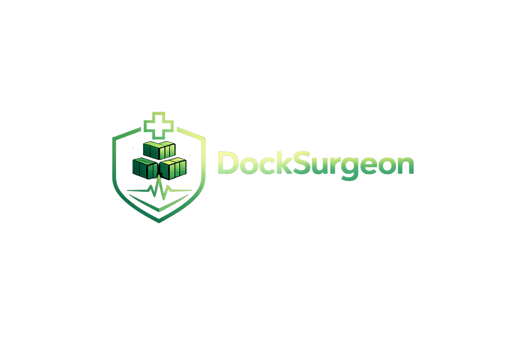

<div align="center">

# 🔪 DockSurgeon

**Perform surgery on your bloated Docker storage. Reclaim your disk space with precision.**

[](https://opensource.org/licenses/MIT)
[](https://github.com/docksurgeon/docksurgeon/pkgs/container/docksurgeon)



</div>

---

### 📋 The Scenario
Your server is running out of disk space. You know Docker is the culprit, but finding exactly which **dangling image**, **unused volume**, or **abandoned container** is eating those 20GBs is a headache. 

**DockSurgeon** gives you the "surgeon's view" — a beautiful, visual dashboard to analyze your storage and perform precise cleanup operations without touching the command line.

---

### ✨ Features
- 📊 **Visual Storage Breakdown**: See exactly how much space Images, Containers, and Volumes are taking.
- 🧹 **One-Click Cleanup**: Safely purge dangling assets that are wasting space.
- 🔍 **Deep Inspection**: View detailed metadata and logs for every Docker object.
- 🛡️ **Secure by Design**: Self-hosted, private, and requires zero external cloud dependencies.
- 🚀 **Smart Port Detection**: Automatically finds available ports to avoid conflicts during setup.

---

### 🚀 Quick Install (Recommended)
This single `curl` command handles everything: pulling the latest image, generating security tokens, and starting the dashboard on port 4242.

```bash
curl -fsSL https://raw.githubusercontent.com/docksurgeon/docksurgeon/main/install.sh | bash
```
🌐 **That's it.** The installer will print your access link and you're good to go!

---

### 🔄 Staying Up to Date
Updating is completely effortless. Just run the exact same `curl` command you used to install it! 
The script will automatically safely remove the old version, download the newest update, and restart your dashboard.

---

### 🏗️ Development
Want to contribute? Setting up a local environment is easy:

```bash
git clone https://github.com/docksurgeon/docksurgeon.git
cd docksurgeon
npm install
npm run dev
```

---

### 🔐 Security & Privacy
- 🔌 **Local Socket**: DockSurgeon communicates directly with `/var/run/docker.sock`.
- 🛂 **Authentication**: Built-in login protection ensures only you can perform surgery.
- 🕵️ **Audit Logs**: Every action is logged for your review.

---

<div align="center">
Built with ❤️ for the Docker Community.
</div>
